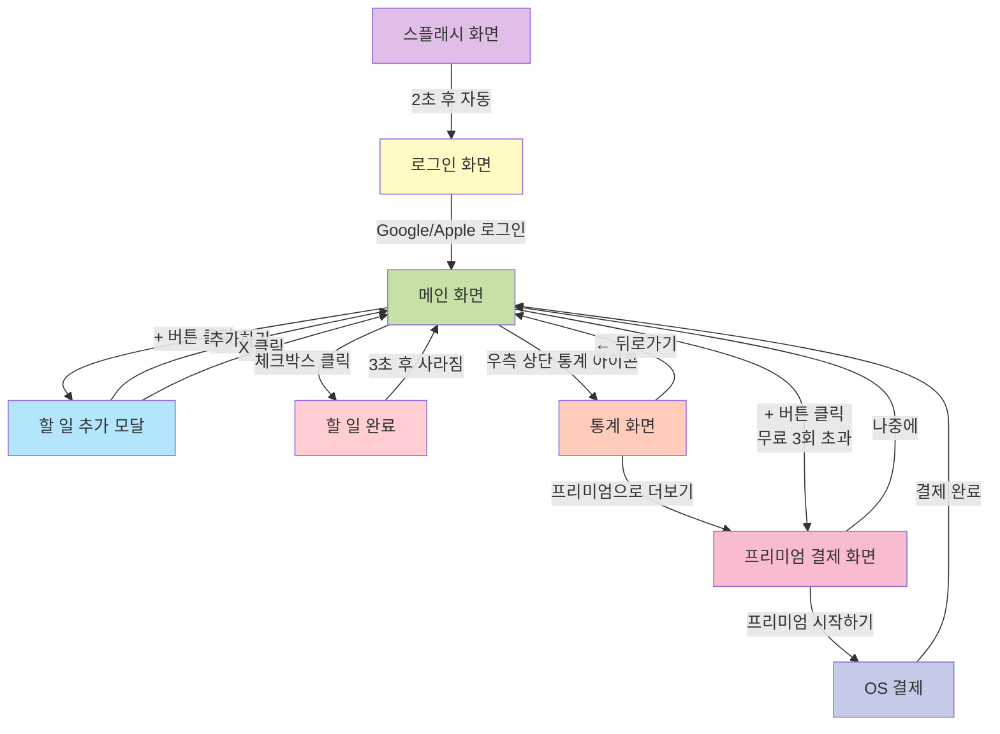

# AI 유저 플로우 생성 - PRD 기반 질문답변 & 결과물 예시

> **목적**: 이미 생성된 PRD를 기반으로, **사용자 여정과 화면 흐름**을 파악하기 위한 질문-답변 과정

> **전제 조건**: Planning Agent를 통해 PRD가 이미 생성되어 다음 정보를 이미 알고 있음
> - ✅ 제품명, 한 줄 설명, 비전
> - ✅ 핵심 문제 및 타겟 사용자
> - ✅ 핵심 기능 3-5개
> - ✅ 비즈니스 모델 (가격, 요금제)
> - ✅ MVP 범위

> **최종 결과물**: 유저 플로우 텍스트 + 화면 ASCII + 머메이드 흐름도

> **중요**:
> - AI가 각 질문마다 **객관식 선택지를 생성**하여 제공합니다.
> - **사용자 답변을 기반으로 다음 질문이 동적으로 생성**됩니다. (꼬리 질문)
> - 기본 틀은 있지만, 답변에 따라 질문 흐름이 달라집니다.

---

## 📑 목차

### Part 1: 질문-답변 세션
- [프로젝트 예시: TaskFlow](#-프로젝트-예시-taskflow---스마트-할-일-관리-앱)
- [AI 인사 및 PRD 확인](#-ai-인사-및-prd-확인)
- [[1단계] 전체 화면 구조 파악](#-1단계-전체-화면-구조-파악) (Q1-Q2)
- [[2단계] 첫 실행 플로우](#-2단계-첫-실행-플로우) (Q3-Q5)
- [[3단계] 메인 화면 구성](#-3단계-메인-화면-구성) (Q6-Q8)
- [[4단계] 할 일 추가 화면](#-4단계-할-일-추가-화면) (Q9-Q11)
- [[5단계] 할 일 목록 상호작용](#-5단계-할-일-목록-상호작용) (Q12-Q13)
- [[6단계] 통계 화면](#-6단계-통계-화면) (Q14-Q15)
- [[7단계] 유료 전환 플로우](#-7단계-유료-전환-플로우) (Q16-Q18)
- [[8단계] 전체 흐름 정리](#-8단계-전체-흐름-정리) (Q19)
- [질문 흐름 요약 (분기 구조)](#-질문-흐름-요약-분기-구조)

### Part 2: 최종 유저 플로우 문서
- [화면 목록](#-화면-목록)
- [사용자 플로우](#-사용자-플로우)
  - [첫 사용자 플로우](#1️⃣-첫-사용자-플로우)
  - [일반 사용자 플로우](#2️⃣-일반-사용자-플로우-데일리-사용)
  - [무료 → 유료 전환 플로우](#3️⃣-무료--유료-전환-플로우)
- [화면 구성 (ASCII)](#️-화면-구성-ascii)
- [화면 흐름도 (Mermaid)](#-화면-흐름도-mermaid)
- [주요 사용자 시나리오](#-주요-사용자-시나리오)
- [문서 완료](#-문서-완료)

---

## 📋 프로젝트 예시: "TaskFlow" - 스마트 할 일 관리 앱

### 기존 PRD 요약 (Planning Agent에서 생성됨)

```markdown
# TaskFlow PRD

## 제품 개요
- **제품명**: TaskFlow
- **한 줄 요약**: AI가 자동으로 우선순위를 정해주는 할 일 관리 앱
- **타겟 사용자**: 2030 직장인, 할 일이 많아 우선순위 파악이 어려운 사람들

## 핵심 기능
1. 할 일 추가/완료 (음성 입력 가능)
2. AI 자동 우선순위 정렬
3. 데일리 생산성 리포트

## 비즈니스 모델
- Freemium: 무료(하루 3회) → 프리미엄(월 14,900원, 무제한)
```

---

## 💬 Part 1: PRD 기반 유저 플로우 질문-답변 세션

### 🤖 AI: 인사 및 PRD 확인

```
안녕하세요! TaskFlow의 PRD를 확인했습니다.

이미 파악한 정보:
✅ AI 우선순위 할 일 관리 앱
✅ 핵심 기능: 음성 입력, AI 우선순위, 생산성 리포트
✅ Freemium 모델 (무료 3회 → 월 14,900원)

이제 사용자가 어떤 화면들을 보고, 어떤 흐름으로 서비스를 이용하는지 질문하겠습니다.
각 질문마다 선택지를 드릴 테니 선택하시거나 직접 입력해주세요.

📌 답변에 따라 다음 질문이 달라질 수 있습니다.
```

---

## 📱 [1단계] 전체 화면 구조 파악

### 🤖 Q1: 앱의 전체 화면 개수는 몇 개 정도인가요?

**질문:**
```
TaskFlow 앱에서 사용자가 보게 되는 화면이 총 몇 개인지 선택해주세요.
```

**🤖 AI가 생성한 선택지:**
```
A) 3-5개 화면 (매우 단순한 구조)
   → 로그인, 메인, 설정 정도의 최소 구성

B) 6-8개 화면 (일반적인 구조) ⭐ 추천
   → 로그인, 메인, 추가, 상세, 통계, 설정 등

C) 9-12개 화면 (복잡한 구조)
   → 다양한 기능과 세부 화면이 많은 경우

D) 직접 입력
```

**👤 사용자 선택:** `B) 6-8개 화면`

**👤 사용자 상세 답변:**
```
총 6개 화면입니다.
```

---

### 🤖 Q2: [꼬리 질문] 그 6개 화면을 하나씩 나열해주세요

> 💡 **이전 답변 기반**: Q1에서 "6개 화면"이라고 답했으므로, 그 6개를 구체적으로 물어봅니다.

**질문:**
```
6개 화면의 이름과 간단한 역할을 알려주세요.
예: 1. 로그인 화면 - 사용자 인증
```

**🤖 AI가 생성한 선택지:**
```
A) 표준 구조 (로그인 → 메인 → 기능 화면들)
   → 일반적인 앱 구조

B) 직접 나열하기 ⭐ 추천
   → 각 화면을 직접 입력
```

**👤 사용자 선택:** `B) 직접 나열하기`

**👤 사용자 상세 답변:**
```
1. 스플래시 화면 - 앱 로딩
2. 로그인 화면 - Google/Apple 로그인
3. 메인 화면 - 할 일 목록 표시
4. 할 일 추가 화면 - 새 할 일 입력
5. 통계 화면 - 생산성 리포트
6. 프리미엄 결제 화면 - 유료 전환
```

---

## 📱 [2단계] 첫 실행 플로우

### 🤖 Q3: [꼬리 질문] 스플래시 화면이 있다고 하셨는데, 얼마나 표시되나요?

> 💡 **이전 답변 기반**: Q2에서 "스플래시 화면"이 있다고 했으므로, 스플래시 관련 질문을 합니다.

**질문:**
```
스플래시 화면이 표시되는 시간과 다음 화면으로 넘어가는 방식은?
```

**🤖 AI가 생성한 선택지:**
```
A) 1-2초 자동 전환 ⭐ 추천
   → 짧게 보여주고 자동 이동

B) 3-5초 자동 전환
   → 브랜드 각인 시간 충분히

C) 탭하면 스킵 가능
   → 사용자가 원하면 건너뛰기

D) 직접 입력
```

**👤 사용자 선택:** `A) 1-2초 자동 전환`

**👤 사용자 상세 답변:**
```
약 2초 동안 표시되고 자동으로 로그인 화면으로 전환됩니다.
```

---

### 🤖 Q4: 로그인 방식은 어떻게 되나요?

**질문:**
```
사용자가 로그인할 수 있는 방법을 선택해주세요.
```

**🤖 AI가 생성한 선택지:**
```
A) 이메일/비밀번호만
   → 전통적인 로그인 방식

B) 소셜 로그인만 (Google, Apple 등) ⭐ 추천
   → 간편한 원탭 로그인

C) 이메일/비밀번호 + 소셜 로그인
   → 두 가지 모두 제공

D) 전화번호 인증
   → SMS 인증 방식

E) 직접 입력
```

**👤 사용자 선택:** `B) 소셜 로그인만`

**👤 사용자 상세 답변:**
```
Google 로그인 버튼과 Apple 로그인 버튼만 있습니다.
이메일/비밀번호 입력 필드는 없어요.
```

---

### 🤖 Q5: [꼬리 질문] 로그인 후 바로 메인 화면으로 가나요?

> 💡 **이전 답변 기반**: 로그인 방식을 알았으니, 로그인 후 흐름을 물어봅니다.

**질문:**
```
로그인 완료 후 어디로 이동하나요?
```

**🤖 AI가 생성한 선택지:**
```
A) 바로 메인 화면 ⭐ 추천
   → 즉시 서비스 시작

B) 온보딩 튜토리얼 → 메인 화면
   → 사용법 안내 후 시작

C) 프로필 설정 → 메인 화면
   → 추가 정보 입력 후 시작

D) 직접 입력
```

**👤 사용자 선택:** `A) 바로 메인 화면`

**👤 사용자 상세 답변:**
```
로그인하자마자 바로 메인 화면으로 이동합니다.
별도 온보딩이나 프로필 설정 없어요.
```

---

## 📱 [3단계] 메인 화면 구성

### 🤖 Q6: 메인 화면의 레이아웃 구조는 어떤가요?

**질문:**
```
메인 화면의 전체 구조를 선택해주세요.
```

**🤖 AI가 생성한 선택지:**
```
A) 상단 헤더 + 리스트 + 하단 네비게이션 바
   → 일반적인 앱 구조

B) 상단 헤더 + 리스트 + 플로팅 버튼 ⭐ 추천
   → 깔끔한 구조, 주요 액션 강조

C) 탭 네비게이션 + 리스트
   → 여러 탭으로 구분된 구조

D) 직접 입력
```

**👤 사용자 선택:** `B) 상단 헤더 + 리스트 + 플로팅 버튼`

**👤 사용자 상세 답변:**
```
상단: "TaskFlow" 제목, 우측에 통계 아이콘
중앙: 할 일 카드 목록
우측 하단: 플로팅 "+" 버튼
```

---

### 🤖 Q7: [꼬리 질문] 상단 통계 아이콘을 누르면 어디로 가나요?

> 💡 **이전 답변 기반**: Q6에서 "통계 아이콘"이 있다고 했으므로, 해당 아이콘 기능을 물어봅니다.

**질문:**
```
우측 상단의 통계 아이콘을 클릭하면?
```

**🤖 AI가 생성한 선택지:**
```
A) 통계 화면으로 이동 ⭐ 추천
   → 전체 화면 전환

B) 통계 모달 팝업
   → 간단한 요약만 팝업으로

C) 직접 입력
```

**👤 사용자 선택:** `A) 통계 화면으로 이동`

**👤 사용자 상세 답변:**
```
통계 아이콘(📊)을 누르면 통계 화면으로 전환됩니다.
```

---

### 🤖 Q8: [꼬리 질문] 플로팅 "+" 버튼을 누르면?

> 💡 **이전 답변 기반**: Q6에서 "플로팅 + 버튼"이 있다고 했으므로, 해당 버튼 기능을 물어봅니다.

**질문:**
```
우측 하단 플로팅 "+" 버튼을 클릭하면 어떻게 되나요?
```

**🤖 AI가 생성한 선택지:**
```
A) 새 화면으로 이동
   → 할 일 추가 전용 화면

B) 모달(팝업) 표시 ⭐ 추천
   → 빠른 입력, 메인 화면 유지

C) 하단 시트 올라옴
   → 아래에서 올라오는 시트

D) 직접 입력
```

**👤 사용자 선택:** `B) 모달 표시`

**👤 사용자 상세 답변:**
```
"+" 버튼을 누르면 할 일 추가 모달이 화면 위에 팝업으로 나타납니다.
```

---

## 📱 [4단계] 할 일 추가 화면

### 🤖 Q9: [꼬리 질문] 할 일 추가 모달의 구성은?

> 💡 **이전 답변 기반**: Q8에서 "모달"이라고 했으므로, 모달 내부 구성을 물어봅니다.

**질문:**
```
할 일 추가 모달에는 어떤 요소들이 있나요?
```

**🤖 AI가 생성한 선택지:**
```
A) 텍스트 입력 필드만
   → 최소한의 구성

B) 텍스트 입력 + 추가 옵션들 ⭐ 추천
   → 마감일, 우선순위 등

C) 직접 입력
```

**👤 사용자 선택:** `C) 직접 입력`

**👤 사용자 상세 답변:**
```
- 상단: "새 할 일" 제목, X 버튼
- 중앙: 텍스트 입력 필드, 마이크 버튼 (음성 입력)
- 하단: "추가하기" 버튼
```

---

### 🤖 Q10: [꼬리 질문] 마이크 버튼이 있다고 하셨는데, 음성 입력은 어떻게 작동하나요?

> 💡 **이전 답변 기반**: Q9에서 "마이크 버튼"이 있다고 했으므로, 음성 입력 상세를 물어봅니다.
> ⚠️ 만약 마이크 버튼이 없다고 했다면, 이 질문은 건너뜁니다.

**질문:**
```
마이크 버튼을 누르면 어떤 방식으로 작동하나요?
```

**🤖 AI가 생성한 선택지:**
```
A) 버튼 누르는 동안만 녹음 (Push-to-talk) ⭐ 추천
   → 버튼 누르고 있는 동안만 녹음

B) 한 번 클릭으로 녹음 시작/종료 토글
   → 한 번 클릭 → 녹음 시작, 다시 클릭 → 종료

C) 자동 음성 인식 (항상 대기)
   → 클릭 시 권한 요청 후 자동 인식

D) 직접 입력
```

**👤 사용자 선택:** `A) 버튼 누르는 동안만 녹음`

**👤 사용자 상세 답변:**
```
1. 마이크 버튼을 길게 누름
2. 처음이면 권한 요청
3. "말씀하세요..." 표시
4. 녹음 중
5. 손 떼면 자동으로 텍스트 변환되어 입력 필드에 입력됨
```

---

### 🤖 Q11: "추가하기" 버튼을 누르면 어떻게 되나요?

**질문:**
```
할 일 추가 완료 후 화면 흐름은?
```

**🤖 AI가 생성한 선택지:**
```
A) 모달 닫힘 → 메인 화면 (즉시 추가됨)
   → 빠른 피드백

B) 모달 닫힘 → 메인 화면 (로딩 후 추가됨) ⭐ 추천
   → AI 분석 시간 필요

C) 상세 화면으로 이동
   → 추가된 할 일의 상세 페이지

D) 직접 입력
```

**👤 사용자 선택:** `B) 모달 닫힘 → 메인 화면 (로딩 후 추가됨)`

**👤 사용자 상세 답변:**
```
1. 모달이 닫힘
2. 메인 화면으로 돌아감
3. 새 할 일이 목록 최상단에 추가됨
4. AI가 우선순위 분석 (1-5초)
5. 우선순위 배지가 나타남
```

---

## 📱 [5단계] 할 일 목록 상호작용

### 🤖 Q12: 메인 화면의 할 일 카드에는 어떤 정보가 표시되나요?

**질문:**
```
할 일 카드에 표시되는 정보를 선택해주세요.
```

**🤖 AI가 생성한 선택지:**
```
A) 제목만
   → 최소 정보

B) 제목 + 우선순위 표시 ⭐ 추천
   → 할 일 + 긴급도

C) 제목 + 우선순위 + 마감일
   → 상세 정보

D) 제목 + 우선순위 + 마감일 + 카테고리
   → 매우 상세

E) 직접 입력
```

**👤 사용자 선택:** `B) 제목 + 우선순위 표시`

**👤 사용자 상세 답변:**
```
- 할 일 제목
- 우선순위 배지 (🔴 긴급 / 🟡 보통 / 🟢 여유)
- 체크박스 (완료 처리용)
```

---

### 🤖 Q13: 할 일을 완료 처리하는 방법은?

**질문:**
```
사용자가 할 일을 완료했다고 표시하는 방법은?
```

**🤖 AI가 생성한 선택지:**
```
A) 체크박스 클릭 ⭐ 추천
   → 간단하고 직관적

B) 카드 스와이프
   → 좌/우로 밀어서 완료

C) 카드 길게 누르기
   → 롱프레스로 완료

D) 직접 입력
```

**👤 사용자 선택:** `A) 체크박스 클릭`

**👤 사용자 상세 답변:**
```
체크박스 클릭하면:
1. 체크 표시 나타남
2. 카드가 흐릿해짐
3. 3초 후 자동으로 목록에서 사라짐
```

---

## 📱 [6단계] 통계 화면

### 🤖 Q14: [이전 Q7 연결] 통계 화면에는 어떤 정보가 표시되나요?

> 💡 **이전 답변 기반**: Q7에서 통계 화면으로 이동한다고 했으므로, 통계 화면 상세를 물어봅니다.

**질문:**
```
통계 화면에서 사용자에게 보여줄 정보를 선택해주세요.
```

**🤖 AI가 생성한 선택지:**
```
A) 완료한 할 일 개수만
   → 간단한 숫자

B) 완료 개수 + 완료율
   → 기본 통계

C) 완료 개수 + 완료율 + 주간 그래프 ⭐ 추천
   → 시각적 통계

D) 완료 개수 + 완료율 + 주간 그래프 + 카테고리별 분석
   → 매우 상세

E) 직접 입력
```

**👤 사용자 선택:** `C) 완료 개수 + 완료율 + 주간 그래프`

**👤 사용자 상세 답변:**
```
- 오늘 완료한 할 일 개수
- 이번 주 완료한 할 일 개수
- 평균 완료율 (%)
- 주간 완료 그래프 (막대 그래프)
```

---

### 🤖 Q15: 통계 화면에서 메인으로 돌아가는 방법은?

**질문:**
```
통계 화면에서 메인 화면으로 돌아가는 방법은?
```

**🤖 AI가 생성한 선택지:**
```
A) 좌측 상단 뒤로가기 버튼 ⭐ 추천
   → ← 버튼

B) 하단 탭 네비게이션
   → 탭 선택

C) 스와이프 제스처
   → 우측으로 스와이프

D) 직접 입력
```

**👤 사용자 선택:** `A) 좌측 상단 뒤로가기 버튼`

**👤 사용자 상세 답변:**
```
좌측 상단 "←" 버튼 클릭하면 메인 화면으로 이동
```

---

## 📱 [7단계] 유료 전환 플로우

### 🤖 Q16: PRD에서 Freemium 모델이라고 했는데, 무료 제한은 언제 나타나나요?

> 💡 **PRD 정보 기반**: PRD에서 "무료 3회"라고 했으므로, 제한 표시 방식을 물어봅니다.

**질문:**
```
무료 사용자가 제한에 도달했을 때 어떻게 알려주나요?
```

**🤖 AI가 생성한 선택지:**
```
A) 메인 화면에 배너 표시
   → "오늘 무료 횟수 3/3 사용"

B) 제한 도달 시 추가 시도 시 팝업 ⭐ 추천
   → 4번째 추가 시도 시 결제 화면

C) 사전 경고 알림
   → "무료 1회 남음" 미리 알림

D) 직접 입력
```

**👤 사용자 선택:** `B) 제한 도달 시 추가 시도 시 팝업`

**👤 사용자 상세 답변:**
```
무료 3회 모두 사용 후
4번째 할 일 추가하려고 "+" 버튼 클릭
→ 할 일 추가 모달 대신 프리미엄 결제 화면 표시
```

---

### 🤖 Q17: [꼬리 질문] 프리미엄 결제 화면 구성은?

> 💡 **이전 답변 기반**: Q16에서 "결제 화면"이 나타난다고 했으므로, 결제 화면 상세를 물어봅니다.

**질문:**
```
프리미엄 결제 화면에 표시할 내용을 선택해주세요.
```

**🤖 AI가 생성한 선택지:**
```
A) 가격만 표시
   → 간결함

B) 가격 + 혜택 3가지 ⭐ 추천
   → 주요 혜택 강조

C) 가격 + 혜택 + 후기
   → 사용자 후기 포함

D) 직접 입력
```

**👤 사용자 선택:** `B) 가격 + 혜택 3가지`

**👤 사용자 상세 답변:**
```
- 제목: "무제한으로 사용하세요"
- 혜택:
  ✅ 할 일 무제한 추가
  ✅ 고급 통계 리포트
  ✅ 우선순위 자동 조정
- 가격: 월 14,900원
- 버튼: "프리미엄 시작하기", "나중에"
```

---

### 🤖 Q18: [꼬리 질문] "나중에" vs "프리미엄 시작하기" 각각 누르면?

> 💡 **이전 답변 기반**: Q17에서 두 버튼이 있다고 했으므로, 각각의 동작을 물어봅니다.

**질문:**
```
각 버튼을 클릭했을 때의 흐름을 알려주세요.
```

**🤖 AI가 생성한 선택지:**
```
A) "나중에": 메인으로 복귀, "시작하기": OS 결제 진행 ⭐ 추천
   → 일반적인 패턴

B) "나중에": 한 번 더 추가 가능, "시작하기": OS 결제
   → 유연한 정책

C) 직접 입력
```

**👤 사용자 선택:** `A) 메인으로 복귀 / OS 결제 진행`

**👤 사용자 상세 답변:**
```
[나중에 버튼]
→ 메인 화면으로 돌아감 (할 일 추가 안됨)

[프리미엄 시작하기 버튼]
1. OS 결제 화면 표시 (앱스토어/구글플레이)
2. 결제 완료
3. 메인 화면으로 복귀
4. 이제 할 일 무제한 추가 가능
```

---

## 📱 [8단계] 전체 흐름 정리

### 🤖 Q19: 지금까지 답변한 내용을 바탕으로 전체 사용자 여정을 정리해볼까요?

> 💡 **모든 답변 종합**: 지금까지의 모든 답변을 기반으로 전체 여정을 확인합니다.

**질문:**
```
사용자가 앱을 사용하는 전체 흐름을 확인해주세요.
이 정보로 최종 문서를 생성합니다.
```

**🤖 AI가 생성한 요약:**
```
제가 이해한 흐름이 맞는지 확인해주세요:

【첫 사용자】
스플래시(2초) → 소셜 로그인 → 메인(빈) → + 버튼 →
할 일 추가 모달(텍스트/음성) → AI 분석 → 우선순위 표시 →
체크박스로 완료 → 통계 확인

【일반 사용】
메인 → 할 일 확인 → + 버튼 → 추가 → 완료 → 통계

【유료 전환】
4번째 추가 시도 → 결제 화면 → 결제 or 나중에

맞나요?
```

**👤 사용자 확인:**
```
네, 맞습니다!
```

---

## 📋 질문 흐름 요약 (분기 구조)

```
Q1: 화면 개수? → "6개"
  └─→ Q2: 6개 화면 나열? → [스플래시, 로그인, 메인, 추가, 통계, 결제]
        ├─→ Q3: 스플래시 시간? (스플래시 있다고 했으므로)
        └─→ Q4: 로그인 방식?

Q6: 메인 화면 구조? → "헤더 + 리스트 + 플로팅 버튼"
  ├─→ Q7: 통계 아이콘 클릭 시? (통계 아이콘 있다고 했으므로)
  └─→ Q8: + 버튼 클릭 시? → "모달"
        └─→ Q9: 모달 구성? → [텍스트 입력 + 마이크 버튼]
              └─→ Q10: 마이크 버튼 작동? (마이크 있다고 했으므로)
                    ⚠️ 만약 마이크 없다면 Q10 스킵

Q7 → 통계 화면 이동
  └─→ Q14: 통계 화면 정보? (Q7에서 통계 화면 간다고 했으므로)
        └─→ Q15: 통계에서 복귀 방법?

Q16: 무료 제한 표시? → "4번째 시도 시 결제 화면"
  └─→ Q17: 결제 화면 구성? (결제 화면 나온다고 했으므로)
        └─→ Q18: 두 버튼 각각 동작?

Q19: 전체 흐름 종합 정리
```

---

## ✅ Part 2: AI가 생성한 최종 유저 플로우 문서

> 아래는 **PRD + 질문-답변 19개**를 바탕으로 AI가 자동 생성한 완전한 유저 플로우 문서입니다.

---

# TaskFlow - 사용자 플로우 문서

> **작성일**: 2025-11-19
> **기반 문서**: TaskFlow PRD v1.0
> **질문-답변**: 19개 질문 완료 (꼬리 질문 포함)

---

## 📱 화면 목록

TaskFlow 앱은 총 **6개의 화면**으로 구성됩니다:

1. **스플래시 화면** - 앱 로딩 (2초)
2. **로그인 화면** - Google/Apple 소셜 로그인
3. **메인 화면** - 할 일 목록 (AI 우선순위 순)
4. **할 일 추가 화면** - 텍스트/음성 입력 모달
5. **통계 화면** - 생산성 리포트 (완료율, 주간 그래프)
6. **프리미엄 결제 화면** - 유료 전환 (월 14,900원)

---

## 🎬 사용자 플로우

### 1️⃣ 첫 사용자 플로우

```
앱 다운로드
  ↓
스플래시 화면 (2초)
  ↓
로그인 화면
  ↓ [Google/Apple 로그인 클릭]
로그인 처리
  ↓
메인 화면 (빈 상태)
  ↓ [우측 하단 + 버튼 클릭]
할 일 추가 모달
  ↓ [텍스트 입력 OR 마이크 버튼 길게 눌러 음성 입력]
  ↓ [추가하기 버튼]
모달 닫힘
  ↓
메인 화면 (할 일 1개 추가됨)
  ↓ [AI가 우선순위 분석 중... 1-5초]
메인 화면 (우선순위 배지 표시됨)
  ↓ [체크박스 클릭]
할 일 완료 처리 (흐릿해짐 → 3초 후 사라짐)
  ↓ [우측 상단 통계 아이콘 클릭]
통계 화면
  ↓ [완료율, 주간 그래프 확인]
  ↓ [← 뒤로가기]
메인 화면
```

### 2️⃣ 일반 사용자 플로우 (데일리 사용)

```
메인 화면
  ↓ [오늘의 할 일 확인 (AI 우선순위 순)]
  ↓ [+ 버튼]
할 일 추가 모달
  ↓ [텍스트/음성 입력]
  ↓ [추가하기]
메인 화면 (목록 업데이트)
  ↓ [할 일 완료하면 체크박스 클릭]
할 일 완료 처리
  ↓ [통계 아이콘]
통계 화면
  ↓ [← 뒤로가기]
메인 화면
```

### 3️⃣ 무료 → 유료 전환 플로우

```
메인 화면 (무료 3회 모두 사용)
  ↓ [+ 버튼 클릭 (4번째 시도)]
프리미엄 결제 화면 표시
  ↓
  ├─ [나중에 클릭] → 메인 화면 (할 일 추가 안됨)
  │
  └─ [프리미엄 시작하기 클릭]
       ↓
     OS 결제 화면 (앱스토어/구글플레이)
       ↓
     결제 완료
       ↓
     메인 화면 (무제한 사용 가능)
```

---

## 🖼️ 화면 구성 (ASCII)

### 화면 1: 스플래시 화면

```
┌─────────────────────────┐
│                         │
│                         │
│                         │
│                         │
│     [TaskFlow 로고]     │
│                         │
│  AI가 정리하는 하루     │
│                         │
│                         │
│                         │
│                         │
└─────────────────────────┘
```

### 화면 2: 로그인 화면

```
┌─────────────────────────┐
│                         │
│      [TaskFlow 로고]     │
│                         │
│   AI가 정리하는 하루     │
│                         │
│                         │
│  ┌───────────────────┐  │
│  │  🔵 Google 로그인 │  │
│  └───────────────────┘  │
│                         │
│  ┌───────────────────┐  │
│  │  🍎 Apple 로그인  │  │
│  └───────────────────┘  │
│                         │
└─────────────────────────┘
```

### 화면 3: 메인 화면 (할 일 있음)

```
┌─────────────────────────┐
│ TaskFlow        [통계📊]│
├─────────────────────────┤
│                         │
│ ┌─────────────────────┐ │
│ │ ☐ 보고서 작성       │ │
│ │ 🔴 긴급             │ │
│ └─────────────────────┘ │
│                         │
│ ┌─────────────────────┐ │
│ │ ☐ 팀 미팅 준비      │ │
│ │ 🟡 보통             │ │
│ └─────────────────────┘ │
│                         │
│ ┌─────────────────────┐ │
│ │ ☐ 이메일 확인       │ │
│ │ 🟢 여유             │ │
│ └─────────────────────┘ │
│                         │
│                    [+]  │
└─────────────────────────┘
```

### 화면 4: 할 일 추가 모달

```
┌─────────────────────────┐
│ 새 할 일            [X] │
├─────────────────────────┤
│                         │
│ ┌─────────────────────┐ │
│ │ 할 일 내용 입력...  │ │
│ │                 🎤  │ │
│ └─────────────────────┘ │
│                         │
│  "마이크 버튼을 길게    │
│   누르면 음성 입력"     │
│                         │
│  ┌───────────────────┐  │
│  │   추가하기        │  │
│  └───────────────────┘  │
│                         │
└─────────────────────────┘
```

### 화면 5: 통계 화면

```
┌─────────────────────────┐
│ ← 내 생산성             │
├─────────────────────────┤
│                         │
│   오늘 완료: 3개        │
│   이번 주: 12개         │
│   평균 완료율: 85%      │
│                         │
│   [주간 그래프]         │
│   ┌─┐                   │
│   │█│ ┌─┐ ┌─┐ ┌─┐       │
│   │█│ │█│ │█│ │█│       │
│   └─┘ └─┘ └─┘ └─┘       │
│   월  화  수  목         │
│                         │
│ ┌─────────────────────┐ │
│ │ 프리미엄으로 더보기 │ │
│ └─────────────────────┘ │
└─────────────────────────┘
```

### 화면 6: 프리미엄 결제 화면

```
┌─────────────────────────┐
│                     [X] │
│  무제한으로 사용하세요   │
│                         │
│  ✅ 할 일 무제한 추가   │
│  ✅ 고급 통계 리포트    │
│  ✅ 우선순위 자동 조정  │
│                         │
│     월 14,900원         │
│                         │
│  ┌───────────────────┐  │
│  │ 프리미엄 시작하기 │  │
│  └───────────────────┘  │
│                         │
│       나중에            │
└─────────────────────────┘
```

---

## 🔀 화면 흐름도 (Mermaid)



---

## 📝 주요 사용자 시나리오

### 시나리오 1: 첫 사용자 (완전 신규)

**목표:** 앱 설치부터 첫 할 일 완료까지

1. 앱스토어에서 TaskFlow 다운로드
2. 앱 실행 → 스플래시 화면 (2초)
3. Google/Apple 로그인
4. 메인 화면 진입 (빈 상태)
5. 우측 하단 + 버튼 클릭
6. 할 일 추가 모달에서 "보고서 작성" 입력 (또는 마이크 버튼 길게 눌러 음성 입력)
7. 추가하기 버튼
8. 메인 화면에 할 일 표시됨
9. AI가 우선순위 분석 (1-5초)
10. 🔴 긴급 배지 표시됨
11. 할 일 완료 후 체크박스 클릭
12. 카드 흐릿해지고 3초 후 사라짐
13. 우측 상단 통계 아이콘 클릭
14. 통계 화면에서 "오늘 완료 1개" 확인
15. ← 버튼으로 메인 화면 복귀

### 시나리오 2: 일반 사용자 (아침 출근 후)

**목표:** 오늘 할 일 추가하고 우선순위 확인

1. 앱 실행 → 메인 화면
2. 어제 완료 못한 할 일 확인
3. + 버튼으로 오늘 할 일 3개 추가
   - 텍스트 입력: "이메일 확인"
   - 음성 입력: "팀 미팅 준비" (마이크 버튼 길게 누름)
   - 텍스트 입력: "보고서 작성"
4. AI가 자동으로 우선순위 매김
   - 🔴 보고서 작성 (긴급)
   - 🟡 팀 미팅 준비 (보통)
   - 🟢 이메일 확인 (여유)
5. 우선순위 순서대로 할 일 처리
6. 완료하면 체크박스 클릭
7. 저녁에 통계 화면에서 오늘의 생산성 확인

### 시나리오 3: 무료 사용자 → 유료 전환

**목표:** 무료 3회 사용 후 결제

1. 메인 화면에서 오늘 할 일 3개 추가 (무료 3회 사용)
2. 4번째 할 일 추가하려고 + 버튼 클릭
3. 할 일 추가 모달 대신 **프리미엄 결제 화면** 표시
4. 혜택 확인:
   - ✅ 할 일 무제한 추가
   - ✅ 고급 통계 리포트
   - ✅ 우선순위 자동 조정
5. "프리미엄 시작하기" 버튼 클릭
6. 앱스토어/구글플레이 결제 화면
7. Face ID/지문 인증으로 월 14,900원 결제
8. 메인 화면으로 복귀
9. 이제 할 일을 무제한으로 추가 가능

---

## ✅ 문서 완료

이 문서는 **TaskFlow의 모든 화면 구성과 사용자 흐름**을 담고 있습니다.

**포함된 내용:**
- ✅ 전체 화면 목록 (6개)
- ✅ 화면별 구성 요소
- ✅ 사용자 플로우 (3가지 시나리오)
- ✅ ASCII 화면 레이아웃 (6개)
- ✅ Mermaid 화면 흐름도
- ✅ 주요 사용자 시나리오 (3개)

**AI 질문-답변 세션 특징:**
- ✅ 총 19개 질문 (기본 질문 + 꼬리 질문)
- ✅ 각 질문마다 AI가 객관식 선택지 생성
- ✅ **사용자 답변 기반 동적 질문 생성** (꼬리 질문)
- ✅ 답변에 따라 질문 스킵/추가
- ✅ 대화형 흐름으로 자연스러운 정보 수집

**질문 분기 예시:**
- Q9에서 "마이크 버튼 있음" → Q10에서 음성 입력 상세 질문
- 만약 "마이크 버튼 없음"이라고 답했다면 → Q10 스킵
- Q8에서 "모달"이라고 답함 → Q9에서 모달 상세 질문
- 만약 "새 화면"이라고 답했다면 → Q9는 다른 질문 생성

**다음 단계:** 이 문서를 바탕으로 개발 착수 가능
